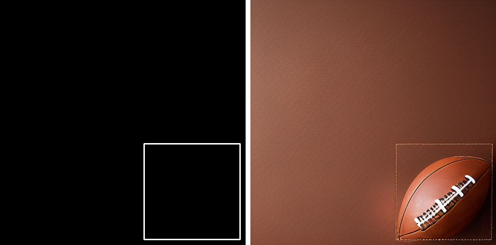
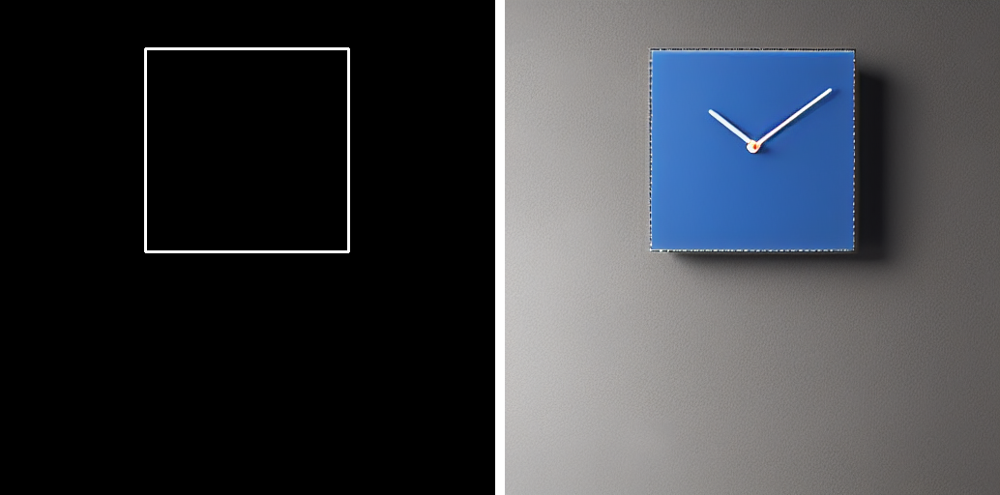
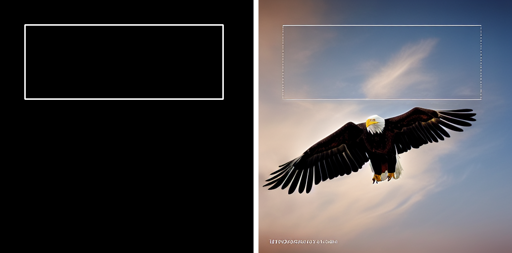

# Stable Diffusion 空间布局控制与实验评测

本项目旨在研究并实现基于文本描述（Prompt）与显式边界框（Bounding Box），在指定空间坐标内精准生成特定物体的功能。项目中包含单图推理脚本与 10 组多元化场景的自动化评测管线。

##  技术路线

* **基础模型**: `Stable Diffusion v1.5` (`runwayml/stable-diffusion-v1-5`)
* **控制管线**: `StableDiffusionControlNetPipeline` 与 `ControlNet Canny` (`lllyasviel/sd-controlnet-canny`)
* **工程优化**: 采用 `UniPCMultistepScheduler` 加速推理，开启 `enable_attention_slicing()` 优化显存占用。
* **控制信号生成**: 采用 `OpenCV` 在纯黑画布绘制目标矩形框，转化为网络控制信号。

##  运行指南

1. **单次测试**: 运行 `controlnet_bbox.py`，生成单张带有指定坐标边界框的受控图像。
2. **批量评测**: 运行 `batch_evaluate.py`，自动执行 10 组涵盖不同方位、尺寸与物体类型的测试用例，结果自动横向拼接并保存至 `output_results/` 目录。

##  实验结果可视化

通过 `batch_evaluate.py` 生成的对比图（左侧为输入的边界框信号，右侧为扩散模型生成结果）：

 
> *图 1：符合预期的空间受控生成示例*

 
> *图 2：失败案例 - 模型将边界框误解为物体的物理轮廓外壳（预期是round clock）*

 
> *图 3：失败案例 - 文本语义与刚性边界框产生冲突导致目标逃逸*

##  局限性分析

通过 10 组 Batch 评测，发现了当前基于 **Canny 刚性线条进行空间约束** 存在的两个核心局限性：

1. **物理实体误判现象 (Case 1, 6, 7, 8, 10)**：扩散模型极易将抽象的边界框（Bounding Box）线条误解为物体的物理轮廓。例如在生成时钟和猫咪时，模型在边界框处强行生成了方形的实体外壳。
2. **柔性语义逃逸隐患 (Case 2, 5)**：当文本语义（如老鹰展翅、圆形网球）与死板的矩形线条发生几何冲突时，模型在去噪过程中倾向于优先满足文本权重，导致物体在框外生成，而框内被敷衍为背景内容（如水波或网线）。

##  改进思考与未来工作

传统的显式线条约束会破坏原生扩散模型的自注意力机制，带来严重的伪影与语义冲突。

**下一步计划**：
放弃显式外部线条控制，转向直接在 U-Net 的潜空间层操作。计划借鉴前沿的无损控制机制（如优化 Cross-Attention 注意力矩阵，采用平滑的二维激活分布引导能量更新），实现非侵入式的精准布局控制；同时进一步探索同一主体在多图生成场景下的外观一致性（Consistent Appearance）锁定方法。